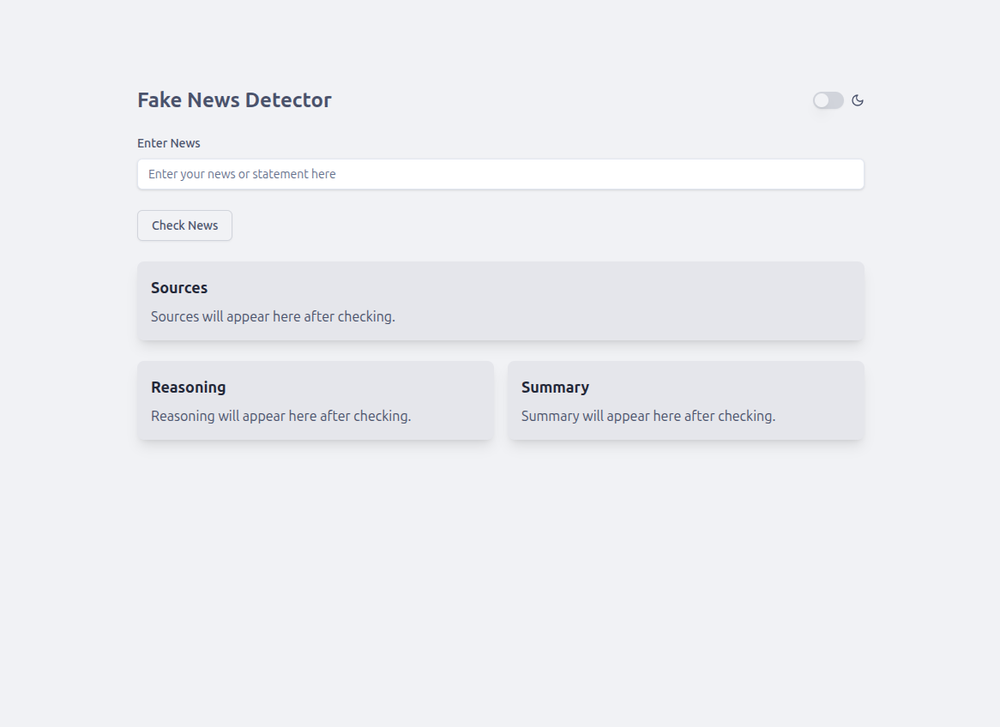

# Fake News Detector

A web-based platform to help users assess the authenticity of news headlines and stories using AI-powered verification and web sources. This project combines a modern frontend and a robust backend agent to deliver verdicts, reasoning, summaries, and source citations for any news input.

---

## 🚀 Preview

<!-- 
Add screenshots or GIFs of the application in action below.
Example:


-->

---

## 🗂️ Project Structure

The repository is organized into two main components:

```
fake-news-detector/
├── fake-news-detector-frontend/   # React frontend app
│   ├── src/                      # Source code (components, utils, styles)
│   ├── public/                   # Static assets
│   ├── index.html                # Vite entry point
│   ├── package.json              # Frontend dependencies
│   └── ...                       # Configs (Vite, ESLint, etc.)
├── fake-news-detector-backend/    # Python backend agent
│   ├── Agents/                   # Agent logic and routes
│   ├── news_verification.py      # News verification logic
│   ├── requirements.txt          # Backend dependencies
│   └── ...                       # Other backend files
└── README.md                     # Project documentation
```

---

## 🛠️ Technologies Used

### Frontend

- **React**: UI library for building interactive web interfaces.
- **Vite**: Fast build tool and development server.
- **Tailwind CSS**: Utility-first CSS framework for design.
- **Radix UI**: Accessible UI primitives (switch, label components).
- **Typewriter Effect**: Animated typewriter-style text for results.
- **Axios**: HTTP client for API requests.

### Backend

- **Python**: Language powering the backend agent.
- **uAgents**: Framework for agent-based communication and REST endpoint setup.
- **REST API**: Exposes `/news` endpoint for news verification.
- **Async/Await**: Ensures scalable, non-blocking backend logic.
- **Web Search & AI**: (Custom logic) Integrates web data and AI models to verify news and generate explanations.

---

## 🧐 How It Works

1. **User Input:**  
   Users enter a news headline or statement in the web app.

2. **Frontend Request:**  
   On clicking "Check News", the frontend sends a POST request to the backend `/news` endpoint.

3. **Backend Processing:**  
   - The backend agent receives the query.
   - It uses AI and web search (e.g., Tavily API, custom logic) to verify the authenticity.
   - Generates a structured response: verdict (`True`, `False`, `Partially True`), detailed reasoning, summary, and sources.

4. **Frontend Display:**  
   - Shows the verdict prominently.
   - Reasoning, summary, and sources are displayed with animated typewriter effects for clarity.
   - Theme toggle (light/dark mode) available for better accessibility.

5. **Source Transparency:**  
   Every result includes references to trusted sources, helping users understand why a headline was flagged.

---

## 💻 Getting Started

### 1. Clone the Repository

```bash
git clone https://github.com/iamasit07/fake-news-detector.git
cd fake-news-detector
```

### 2. Setup Frontend

```bash
cd fake-news-detector-frontend
npm install
npm run dev
```
Visit [http://localhost:5173](http://localhost:5173).

### 3. Setup Backend

```bash
cd ../fake-news-detector-backend
# Create and activate a Python virtual environment (optional but recommended)
pip install -r requirements.txt
python Agents/agent.py
```
The backend should run at `localhost:8009`.

---

## 📦 API Reference

### `POST /news`

- **Request Body:**  
  ```
  {
    "query": "Your news headline or statement"
  }
  ```
- **Response:**  
  ```
  {
    "response": "Verdict: True ... Reason: ... Summary: ... Sources: ..."
  }
  ```

---

## 📸 Preview Images
Example:


---

## 🤝 Contributing

Contributions, bug reports, and suggestions are welcome!  
- Fork the repo, create a branch, and submit a PR.
- Please open issues for feature requests or bugs.

---

## 📝 License

This project is licensed under the MIT License.

---

**Maintainer:** [iamasit07](https://github.com/iamasit07)
